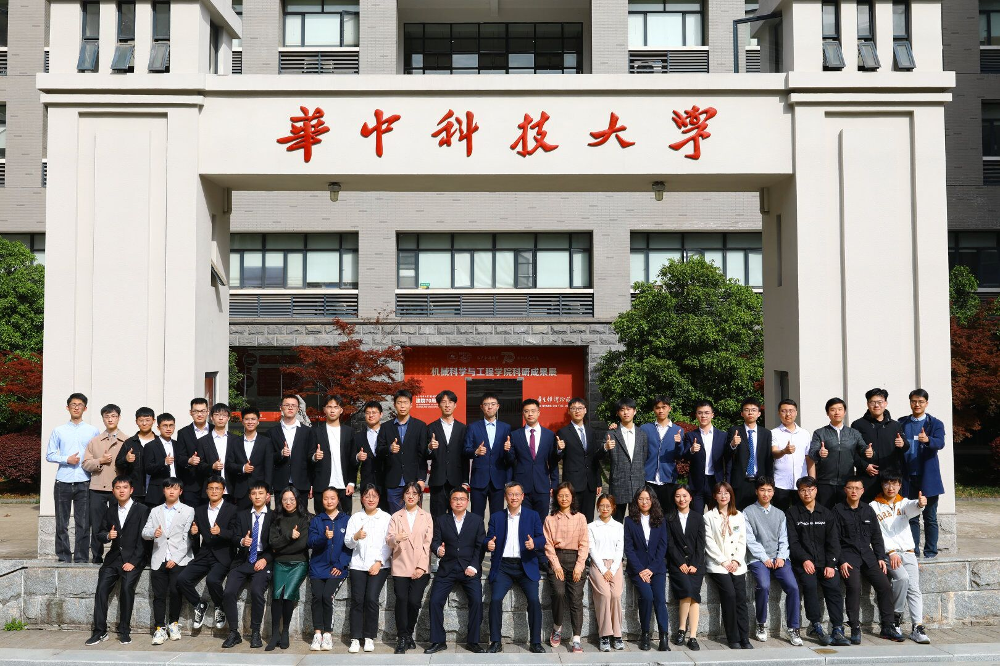

Hi, I'm Zhang Teng. You can call me Simon. This is my personal academic homepage. Of course, in addition to my publication and basic information, some blogs or some interesting things can be found randomly here.

I am currently a PhD Canadian in Mechanical Engineering. My research interests are in **Artificial Intelligence**, **Industrial Robotics**, **Robot Precision Control**, **Vision Measurement**, etc. I have been working on a number of research projects in the field of Mechanical Engineering. But these only represent the focus of the recent period. In the future, I may conduct more interesting research such as *embodied intelligence*, *intelligent human-robot interaction*, *industry 5.0*, *unified robot cognitive framework*, etc.

Hope to become friends with you. You can contact me at [Gmail](zhangteng.hust@gmail.com) and [EDU](zhang_teng@hust.edu.cn).

### Group

Here's the group of our team!!!

