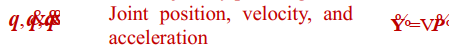
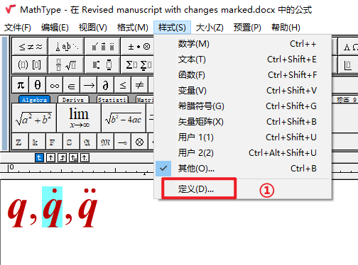
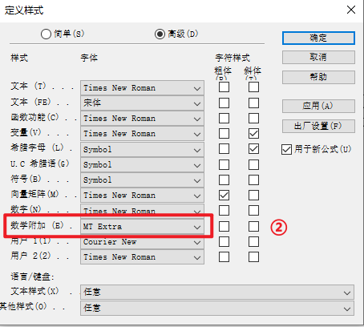
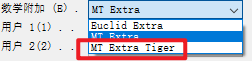

[TOC]

#### 引言

最近在系统投稿过程中发现，生成的PDF在公式上存在很大的问题，出现一些乱七八糟的错乱，这种集中出现我预计与投稿系统的升级有关，不知道是否有别的小伙伴有遇到类似的问题，针对这个问题，经过测试，发现一个行之有效的方法，希望对大家有帮助。

#### 解决办法

问题展示：

上图中，本来的公式是：${q},\dot{q},\ddot{q}$，和$\widetilde{Y}=\Delta\widetilde{P}$

但乱码之后就出现了上述这些看不懂的表达。

经过调整之后，有效的方法操作步骤如下：

如果我没有猜错的话，你的这个部分一定和我一样，显示的是MT Extra，没错就是这里，改他！

我修改为了如下所示的，就没有问题了，都可以正常显示了

#### 结论

希望我上述的分享可以让你在马上投稿的时候，不那么着急。

题主也会将自己遇到的其他的关于投稿过程中与公式相关踩过的坑与大家分享，也希望大家可以在下方留言。

科研人必将团结起来！
