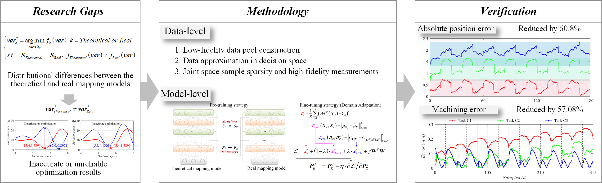

### Contribution 

In this paper, from the perspective of knowledge embedding and transfer, an accurate mapping model is reconstructed through highfidelity sparse sample labeling to achieve more accurate and reliable optimization results. The contributions of this work can be summarized in the following three points:

1. At the data level, stage knowledge, population density knowledge, and redundant sample knowledge optimized based on the theoretical mapping model are embedded into high-fidelity sparse data through three steps sparse and real measurements.

2. At the model level, pre-training and domain adaptation fine-tuning strategies transfer the mapping knowledge from the model in the form of structures and parameters to the real model, and achieve accurate reconstruction of the real mapping model with high-fidelity data.

3. The proposed method is experimentally validated for robotic milling machining on workpieces extracted from local features of space segment parts. It achieves smaller absolute position error and machining error compared to the optimization based on theoretical mapping model, which fully confirms the innovative research perspective of this study.

   

In the future, the actual working condition data and the uncertainty in the machining process will be integrated to realize the accurate and efficient reconstruction of the real mapping model. In addition, we will extend the method studied in this paper to different working conditions. The optimization enhancement from the theoretical model to the actual model for a single working condition to the optimization enhancement for different working conditions will be realized. Finally, inspired by multi-task evolutionary transfer learning, we plan to address the differences in optimization results due to distributional differences from a thorough transfer learning perspective.

### Graphic Abstracts

The graphic abstract is shown below

